[アスタルテ アドベントカレンダー 2021 ](https://adventar.org/calendars/6167)Day.19

# 超入門　筆跡性格診断

## ～ MBTI と筆跡の関係 ～

覚えてらしたらお久しぶりです。
そうでない方は初めまして、**INFJ** 型の**古山キリヲ**([khirio@kirishima.cloud](https://kirishima.cloud/@khirio))です。

この 2 年間、塾の仕事を通して他人の字を見る機会が多かったため、その中で発見した「筆跡と性格の関係」についてまとめてみました。**MBTI** の 16 タイプを例にとって、それぞれの筆跡の特徴を解説していきます。

最初に断っておきますが、私は心理学の専門家ではないし、統計的にまとめるには調査対象の母数が圧倒的に足りません。ですので、信憑性についてはあまり期待しないでください。

## MBTI とは

**MBTI**（**M**yers–**B**riggs **T**ype **I**ndicator）とは、認知特性に基づいて、人間の性格を 16 タイプに分類する性格診断法です。一般的には「16 タイプ性格診断」の名前で広まっています。

- [16Personalities: 無料性格診断テスト](https://www.16personalities.com/ja)
- [精密性格診断テスト 16TEST](https://16test.uranaino.net/)/

MBTI では、「E/I」「S/N」「F/T」「P/J」の 4 つの文字の組み合わせで性格を表します。それぞれの文字は「外向/内向」「感覚/直観」「感情/論理」「探索/計画」の軸を表しています。（より厳密な診断のために、「A/T」＝「安定/不安定」の第 5 の軸を加える場合もあります。）

各タイプに対して著名な男性キャラを当てはめると、以下の表のようになります。

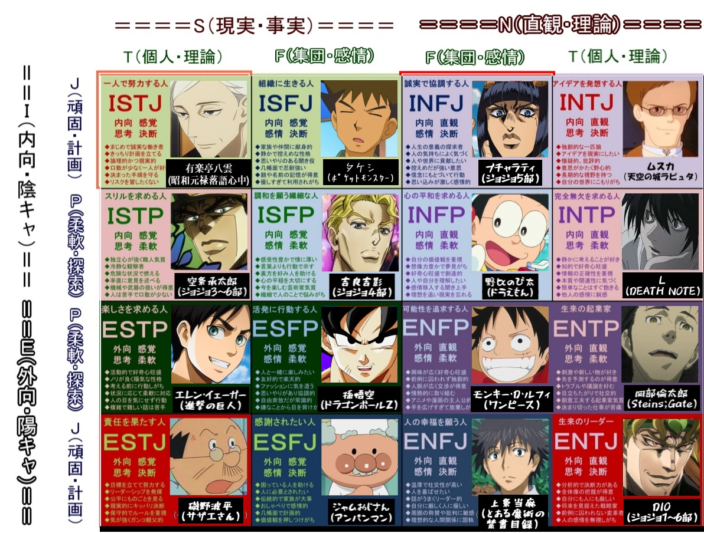

出典：[キャラクター性格診断スレまとめWiki](https://character-seikaku.memo.wiki/)

MBTIのタイプは、一生変わらないわけではなく、環境の変化や他人との関わりによって変化することがあります。そのため、他人の性格を MBTI で診断しようとすると、多くの場合一つに絞ることができません。

## 筆跡から分かる性格

昔から手書きの文字はその人の性格を表すと言われています。

おおよそ 17 歳ごろまでに、筆跡は安定していくようです。利き手の違いは、筆圧の差として現れることもありますが、基本的には関係ありません。精神状態や、精神疾患・発達障害の有無に左右されることもありますが、それについては割愛します。

特に男性の場合、筆跡と MBTI のタイプには強い関連性があります。全体としては次のような傾向が挙げられます。

- XXXP 型は、「田」など四角形の右上の角が丸く、あるいは「乁」の形になる
- XXFP 型は字が汚く、男女間の字形の差が大きい
- XXXJ 型は、ハネ・ハライの勢いが強い
- XXTJ 型は、男女間の字形の差が小さい

もちろん、ペン習字を習って矯正した人や、草書の筆跡はこれらに当てはまりません。また、人によっては字が右回り/左回りに 20 度ほど回転する場合がありますが、それは MBTI のタイプとは関係ないようです。

というわけで、ここからは特徴の分かりやすい順に、各タイプの筆致の特徴を挙げていきます（人名はすべて敬称略）。

違いが分かりやすいように、今回は男性の筆跡のみに絞っています。あしからず。

# ISFP

ジョジョ第 4 部に、**吉良吉影**の家に潜入し、彼が書いた「爪の伸び」を記録したノートを発見するシーンがあります。ISFP 型の人間の書く字は、まさにこんな感じです。

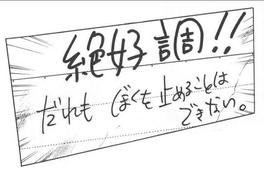

ノートの線に合わせられないどころか、文字が上下にガタついており、一直線上に書くことができません。メンタルの不安定さが如実に表れています。16 タイプの中で最も特徴的な筆づかいと言えるでしょう。著名人では**草彅剛**がこのタイプです。

# ISTP

極端に小さくて丸く、つかみどころのない（物理的な意味で）字が特徴です。かわいい。著名人では**佐藤健**がこのタイプです。変なスタンプとか送ってくるやつ。

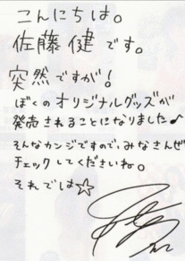

# INTP

縦に長い字が特徴で、文字を詰めて書く癖があります。横書きのときは特に顕著です。著名人では、**庵野秀明**がこのタイプに当てはまります。

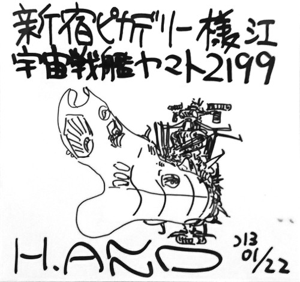

# INFP

「汚い字」のお手本のような筆跡です。丸くて雑な字形が最大の特徴です。頑張ればそれなりに読みやすい字を書くことができますが、頭の回転に手が追いついていないため、基本グチャグチャになります。著名人では**宮崎駿**がこのタイプです。

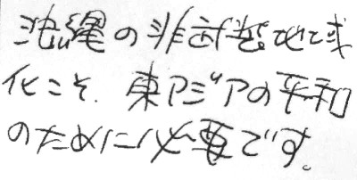

# ISFJ

右肩上がりで筆圧が薄く、真面目かつ、そそっかしい印象を与える筆跡です。また漢字の「角」などの中の四角を極端に小さく書くことや、ヤマアラシのように線が外に飛び出すことも特徴です。著名人では、**山田孝之**がこのタイプに当てはまります。

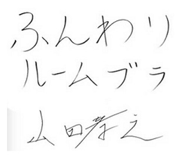

# ISTJ

達筆マンその①。極端に大きく、そして整った字形が特徴です。ノートの線のギリギリまで詰めた字を、驚くほどの速さでビッシリ書いていくタイプです。頭の回転の速さが筆跡に現れています。著名人では**藤井聡太**がこのタイプだと言われています。

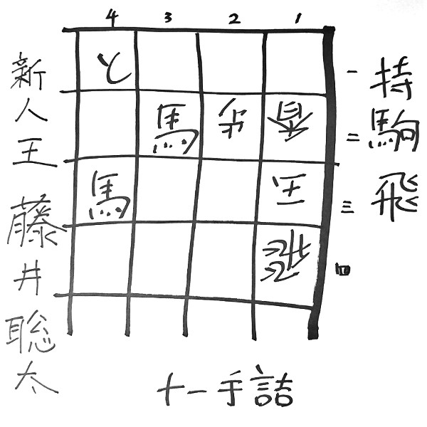

# INTJ

縦に長く、鋭い字を書くことが特徴です。トメるべき線を下に伸ばしがちな癖があります。また、助詞（の、と...）が極端に小さくなることも特徴です。著名人では**菅田将暉**がこのタイプだと言われています。

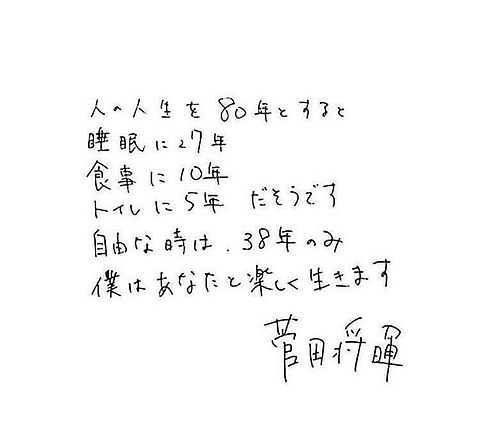

# INFJ

基本的には整っていますが、紙からペンを離さず、一筆書きのように書きたがることが特徴です。メンタルに筆跡が左右されやすく、その時々によって別人のような（ESTJ・ENTJ・INTJ・INTP など）筆跡になる傾向があります。

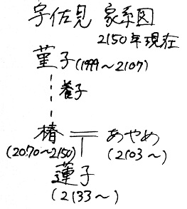

# ESFP

線が様々な方向に伸びる、まるでデザイン字のような字体が特徴です。一つの文書で同じ漢字を書くとき、毎回違う字体で書く傾向があります。ISFP と少し似ていますが、軸が安定しています。著名人ではジブリの**鈴木敏夫**がこのタイプだと言われています。

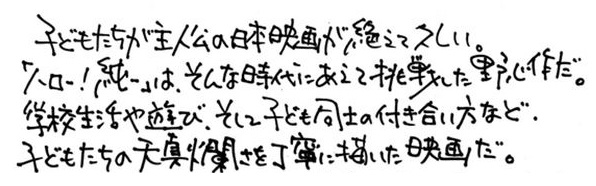

# ESTP

ISTP と似た小さな字が特徴ですが、少し縦に長く、より筆の勢いが強いという違いがあります。これは ESTP のリアリストな面の表われと言えます。著名人では**ローランド**がこのタイプです。

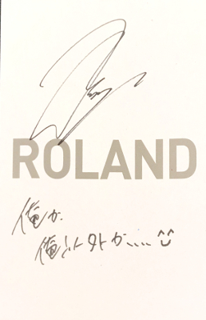

# ENTP

ISTP と INTP を足して 2 で割ったような、小さめで丸く縦長な字が特徴です。INTP と比べてハライやハネの線が横に広がっており、外向性が目立ちます。著名人では**落合陽一**がこのタイプです。

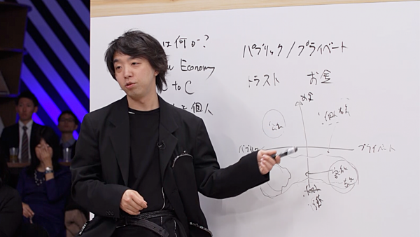

# ENFP

INFP と似た字形ですが、とにかく漢字の「口」などの四角形を大きく書く癖があります。16 タイプの中で最も大きく、丸い字が特徴です。著名人では**中居正広**がこのタイプに当てはまると言われています。

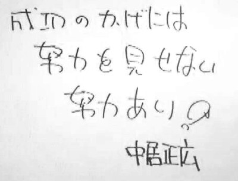

# ESFJ

女性の場合は、漢字とひらがなの大きさに大きな差が出ます。男性の場合は、線が外側に広がった、子供っぽい字になります。著名人では**小野坂昌也**がこのタイプです。

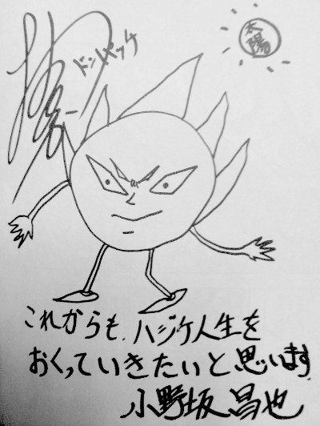

# ESTJ

達筆マンその②。まるでサインのような崩れた字を書きます。落ち着いているときには整った字を書くことも。しかし基本的にテンション高めなので、字が躍っています。著名人では**松本零士**がこのタイプです。

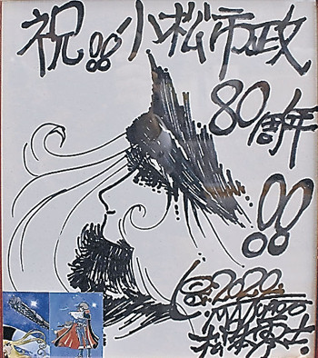

# ENTJ

達筆マンその③。安定感のある、綺麗な楷書体が特徴です。INFJ と同じく、あまり紙からペンを離さず一筆書きのように書く傾向があります。著名人では**霧島ひなた**がこのタイプです。

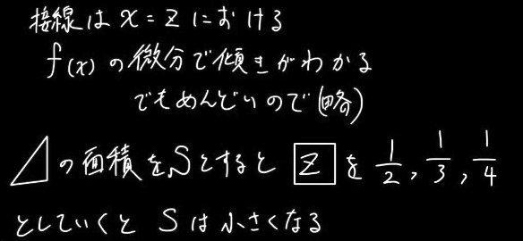

# ENFJ

最も特徴の掴みづらいタイプです。（母集団が少なくてサンプルが得られなかった…）強いて言うならば、縦長で極端に小さい字が特徴です。XXXJ 型は大きな字が特徴ですが、ENFJ だけは仔犬のような小さい字を書く傾向があります。著名人では、**桑田佳祐**がこのタイプに当てはまります。

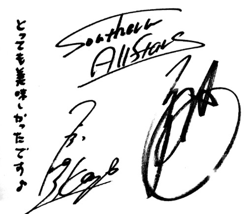

# まとめ

当記事では MBTI の各タイプの典型的な筆致を、実例を挙げて解説しました。ここに挙げたものは、ほんの一例に過ぎません。人によっては、各タイプの類型に当てはまらない字を書く人もいます。しかし何にせよ、筆跡からその人の性格を推察できることは確かです。

さて、あなたの文字はどのタイプ？

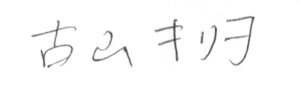

